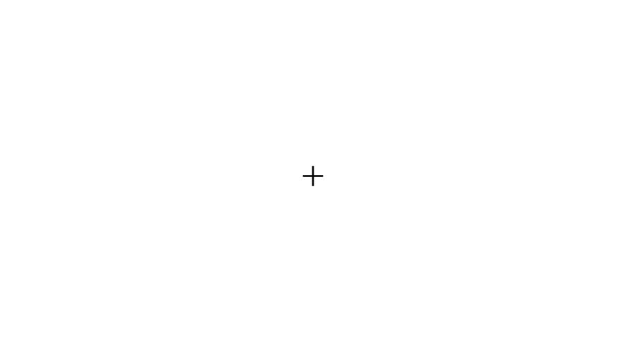

# ANT-I

The Attention Network Test - Interaction (ANT-I) is a modification of the [original ANT](https://github.com/a-hurst/ANT) paradigm developed by [Callejas, Lupiáñez, and Tudela (2004)](https://doi.org/10.1016/j.bandc.2004.02.012). The ANT-I extends the original ANT by replacing the cue conditions meant to measure alerting (central, double) with a brief auditory alerting signal and making spatial cues either valid, invalid, or absent. This extension allows researchers to explore interactions between the alerting network and the orienting network in their effects on accuracy and reaction time.

This experiment program is a direct replication of the version of the ANT-I presented in E1 of [Callejas, Lupiáñez, Funes, and Tudela (2005)](https://doi.org/10.1007/s00221-005-2365-z), rewritten in Python using the KLibs framework.




## Requirements

This version of the ANT-I is programmed in Python 2.7 (3.3+ compatible) using the [KLibs framework](https://github.com/a-hurst/klibs). It has been developed and tested on macOS (10.9 through 10.13), but should also work with minimal hassle on computers running [Ubuntu](https://www.ubuntu.com/download/desktop) or [Debian](https://www.debian.org/distrib/) Linux, as well as on computers running Windows 7 or newer with [a bit more effort](https://github.com/a-hurst/klibs/wiki/Installation-on-Windows).

## Getting Started

### Installation

First, you will need to install the KLibs framework by following the instructions [here](https://github.com/a-hurst/klibs).

Then, you can then download and install the experiment program with the following commands (replacing `~/Downloads` with the path to the folder where you would like to put the program folder):

```
cd ~/Downloads
git clone https://github.com/a-hurst/ANTI.git
```

### Running the Experiment

This version of the ANT-I is a KLibs experiment, meaning that it is run using the `klibs` command at the terminal (running the 'experiment.py' file using python directly will not work).

To run the experiment, navigate to the ANTI folder in Terminal and run `klibs run [screensize]`,
replacing `[screensize]` with the diagonal size of your display in inches (e.g. `klibs run 24` for a 24-inch monitor).

If you just want to test the program out for yourself and skip demographics collection, you can add the `-d` flag to the end of the command to launch the experiment in development mode.


### Configuration

The default configuration of this version of the ANT-I is identical to that of E1 in [Callejas et al. (2005)](https://doi.org/10.1007/s00221-005-2365-z), meaning that the design has 3 blocks of 144 trials, the cue duration is 100ms, the interval between cue and target onsets (SOA) is always 500ms, and targets with neutral flankers are present on 1/3 of trials. These settings can be easily changed to better fit your own research.

The SOA and flanker types can be configured through the experiment's `ANTI_independent_variables.py` file, located in the `ExpAssets/Config` folder. For example, to add an SOA of 100ms and remove the neutral flankers (as in E2 of Callejas et al., 2005), you would edit these lines:

```python
ANTI_ind_vars.add_variable("flanker_type", str, ["congruent", "neutral", "incongruent"])
ANTI_ind_vars.add_variable("soa", int, [500])
```

to look like this:

```python
ANTI_ind_vars.add_variable("flanker_type", str, ["congruent", "incongruent"])
ANTI_ind_vars.add_variable("soa", int, [100, 500])
```

Additionally, the number of trials per block, blocks per experiment, and cue duration can be set in the experiment's `ANTI_params.py` file in the `ExpAssets/Config` folder.
 

### Exporting Data

To export data from the ANTI, simply run

```
klibs export
```

while in the root of the ANTI directory. This will export the trial data for each participant into individual tab-separated text files in the project's `ExpAssets/Data` subfolder.
